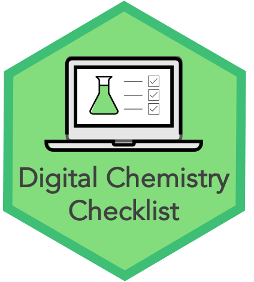

# Digital Chemistry Checklist 

**🚧Under construction 🚧**

## Intro
This repository is a resource for research groups using a automated chemical synthesis machine to perform automated experiments. We provide documentation, checklists, and templates to help groups create a workflow that ensures their data stays safe, properly labelled, and reusable, even when users join and leave the group. 

We hope that this will:
1. Make things easier for researchers, by helping them to keep their data labelled, backed up, and organised. 
2. Facilitate the collection of larger datasets, which will allow for the application of machine learning and other techniques.

<!-- 
## Our software
In the future we could have software to automate part of the work. 

## Our documentation and templates
<!--
We have written the following documentation:
* [documents/our-approach.md](documents/our-approach.md): Gives an overview of our approach.
* [documents/it-setup.md](documents/it-setup.md): Explains how to set up a computer attached to a Chemspeed machine in order to facilitate our approach. Useful to share with your IT department. 
* [documents/templates/technician-template.md](documents/templates/technician-template.md): Template guidelines, for a technician working with users of a Chemspeed machine.
* [documents/templates/user-template.md](documents/templates/user-template.md): Template guidelines, for regular users of a Chemspeed machine.
-->

Documentation and templates are written in [markdown](https://daringfireball.net/projects/markdown), which an is easy-to-read and easy-to-write plain text format. You can convert the markdown files to your favourite format (e.g. html, latex, PDF, word, etc), for example using [pandoc](https://pandoc.org/)). 

## License
We have chosen to [license](LICENSE.md) these documents with a CC-BY license, meaning that you are share and adapt it, as long as you give credit and do not impose additional restrictions. 

## Citation
This project uses [zenodo](https://help.zenodo.org/features/) to make this repository easier to cite. Zenodo keeps track of the different releases. Click on the zenodo badge (), and scroll down to copy the citation.

## Get in touch
We'd love to hear from you if you are thinking about using or adapting these guidelines or if you have have any suggestions for their improvement. We'd be happy to work with you to help these docs work for you. If you're familiar with GitHub, please do this by openining an issue. If you're not familiar with GitHub, please email natalie.thurlby@bristol.ac.uk.

If you'd like to contribute further, please read our [contribution guidelines](CONTRIBUTING.md).

## Funded by
This project was supported by Jean Golding Institute seedcorn funding.

## The Team
* Ella Gale 
* Natalie Fey
* Natalie Thurlby

